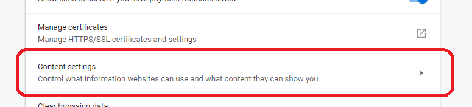
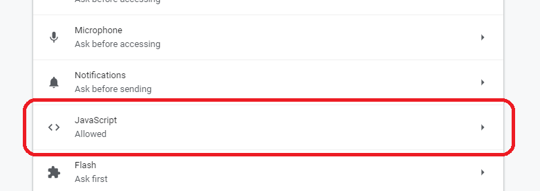

# 00 Pure Client

Demo:
  - Use React + Fetch.
  - Access Github rest api retrieve list of members that belong to a _Lemoncode_ group.

# Steps

- Show the react code.

_./src/memberTable.tsx_

- Let's install dependencies.

```
npm install
```

- Let's run the app

```
npm start
``` 

- Fine, let's disable Javascript and check what data would get a bot like.

**Open Chrome >> Settings >> Advanced >> Content Settings >> Disable >> Javascript (Allowed Off).**

- Let's run the sample and check (white window)

Advanced >> Content Settings



Cotent Settings >> Javascript



- Let's reload the page and check what happens.


